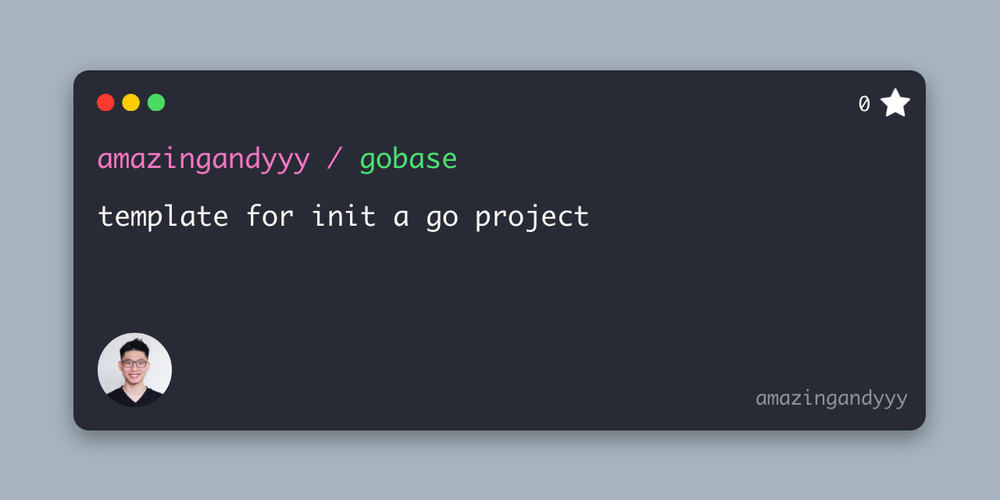

<p styles="font-size: 20rem" align="center">
    
</p>
<h1 align="center">
gocrud
</h1>
<h4 align="center">
CRUD in go
</h4>
<p align="center">
Go Create, Read, Update, Delete
</p>

## Development

### Initialization

```sh
git clone https://github.com/amazingandyyy/gocrud.git
cd gocrud
./script/setup.sh
```

### Trigger pre-commit hook manually

```sh
pre-commit run --all-files
```

---



## Contribution

- Try out this tool
- Star this repo
- Share with your friend!
- [Create issue](https://github.com/amazingandyyy/gocrud/issues/new)
- Create PRs

## Resources

- [regex101](http://regex101.com)
- wildcard

## LICENSE

[MIT](LICENSE)
